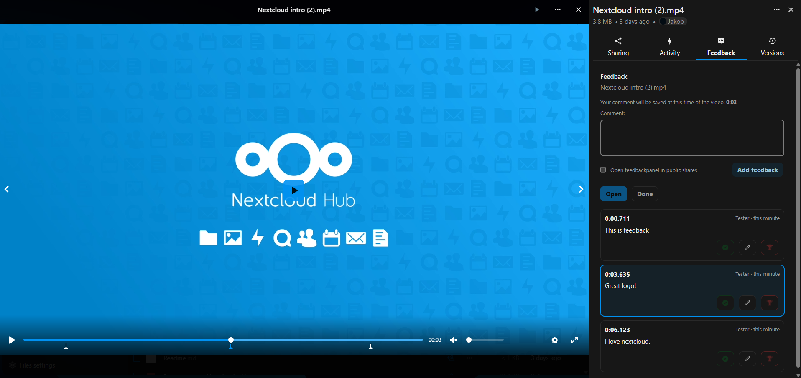

# Feedback App

`feedbackapp` is a custom Nextcloud app for video review workflows.

It adds a **Feedback** sidebar for video files with timestamped comments, timeline markers, comment status handling, and public-share review support.



## Support

If the project helps you, you can support it here:

[](https://buymeacoffee.com/hesoyammw3k)


## Status

This project is in active development, but already usable for real testing and manual deployment.

Current tested baseline:

- Nextcloud `33`
- local test instance
- manual deployment through `custom_apps/feedbackapp`

## Features

- Timestamped feedback for video files
- Millisecond-precision comment storage
- Jump-to-timestamp by clicking a comment
- Timeline markers for open/done feedback
- Open / Done workflow
- Edit and delete for comment authors
- Notifications for file owners
- Public-share feedback panel for guest reviewers
- Guest comment edit/delete for the same browser identity

## Project Structure

```text
custom_apps/feedbackapp/
  appinfo/        Nextcloud app metadata and routes
  css/            Runtime styles
  js/             Built frontend assets used by Nextcloud
  lib/            PHP controllers, services, notifications, migrations
  src/            Frontend source files
  templates/      Server-rendered template entrypoints
```

Repository-level folders:

- `custom_apps/feedbackapp`: actual app source
- `DEPLOYMENT.md`: manual deployment notes

## Local Development

### Requirements

- Node.js / npm
- Nextcloud `33`

### Frontend build

From `custom_apps/feedbackapp`:

```powershell
npm.cmd install
npm.cmd run build
```

### Enable the app

Enable the app in your local Nextcloud test instance:

```powershell
php occ app:enable feedbackapp
```

## Manual Deployment

Upload the built app to your server so the target folder is:

- `custom_apps/feedbackapp`

Then set owner and permissions and enable it with:

```bash
sudo chown -R 33:33 /path/to/nextcloud/custom_apps/feedbackapp
sudo chmod -R 755 /path/to/nextcloud/custom_apps/feedbackapp
php occ app:enable feedbackapp
```

See `DEPLOYMENT.md` for the short step-by-step version.


## Current Limitations

- The app is not packaged for the Nextcloud App Store yet
- Public-share support is currently focused on directly shared video files
- Automated tests are not set up yet
- The app still needs hardening and cleanup before a store release

## Roadmap

- Backend tests
- Frontend cleanup / refactor
- Packaging and release hardening
- App Store publishing

## License

This project is licensed under the GNU Affero General Public License v3.0 or later.
